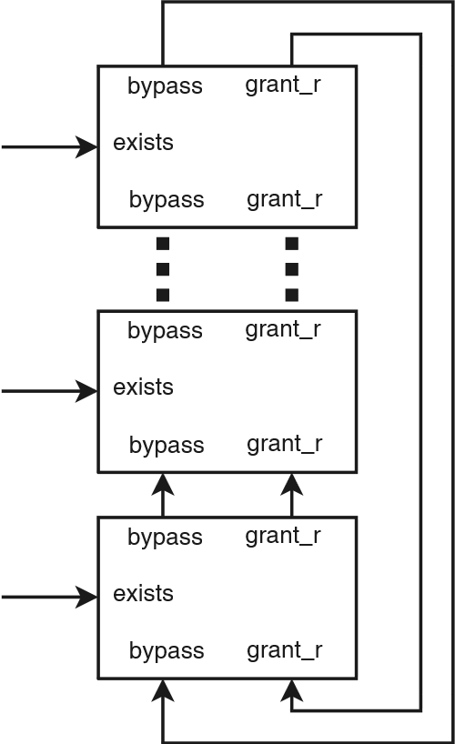
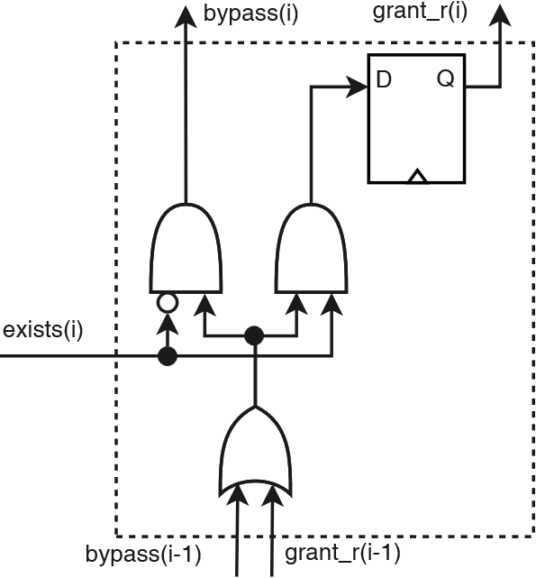

# Time Division Multiplexing with Round-Robin Hardware Arbiter

This repository contains a hardware component that acts as a Time Division 
Multiplexing (TDM) with Round-Robin (RR) arbiter. This component is written 
in synthesizable VHDL. 

## Arbiter Design
The arbiter is designed as a multi-stage arbiter, where each transmitter 
provides an input signal called `exists`. If this signal is asserted, 
then the transmitter signals that it has data for transmission and 
it wants to participate in the next arbitration event (which is done 
every rising clock edge). A top-level picture of the arbiter is 
shown in the next figure.

The logic inside each stage is shown in the next figure.

## Testing
The component has been tested and simulated using the following tool:
- Mentor Graphics ModelSim PE 10.3

## License
This hardware component is licensed under the BSD license shown 
in [LICENSE.md](LICENSE.md)

## Bugs/Questions
If you find any bugs or have any questions, please contact 
[Mohamed A. Bamakhrama](mailto:mohameda@ieee.org)